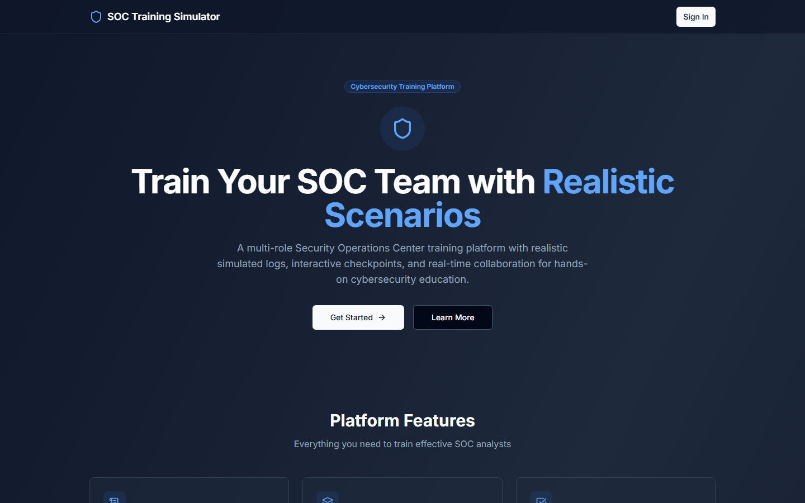
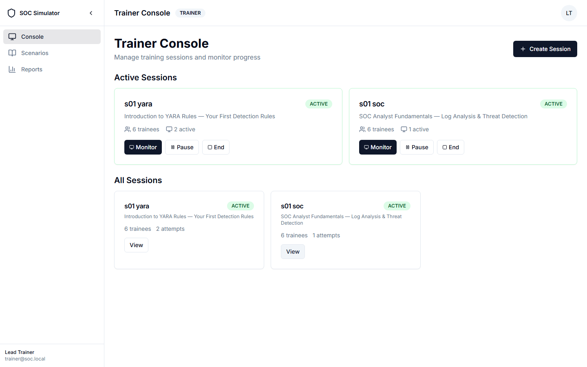
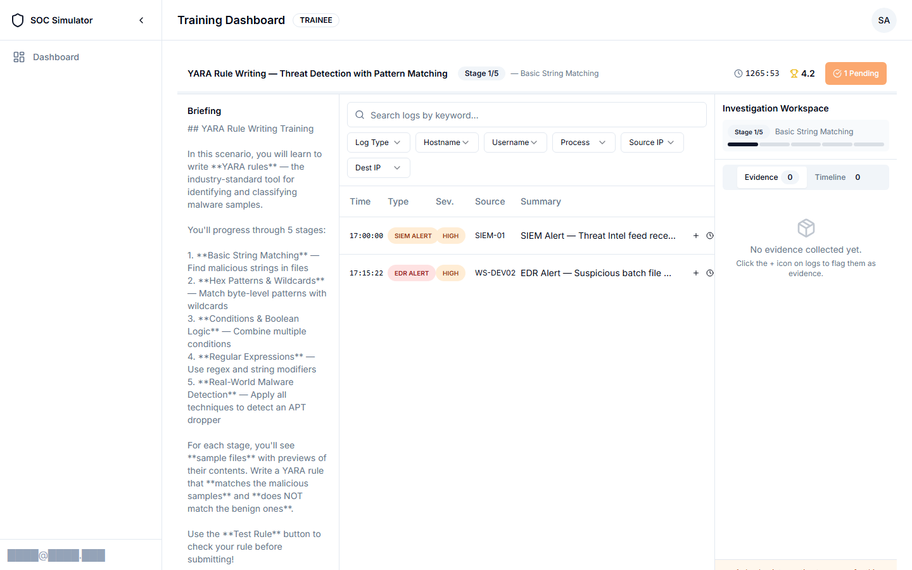
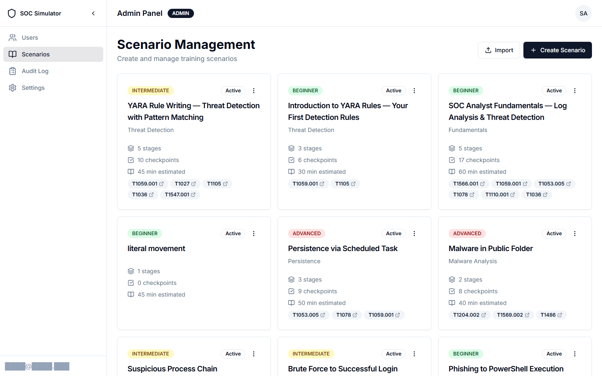
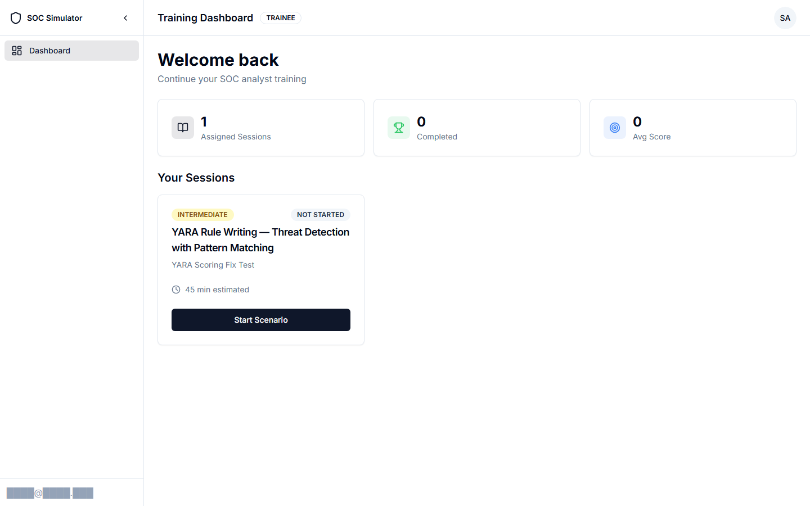
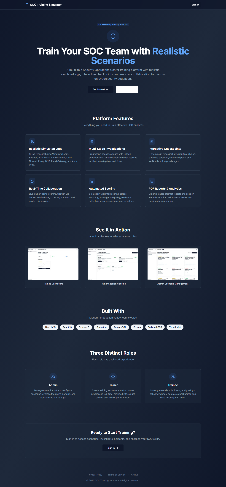
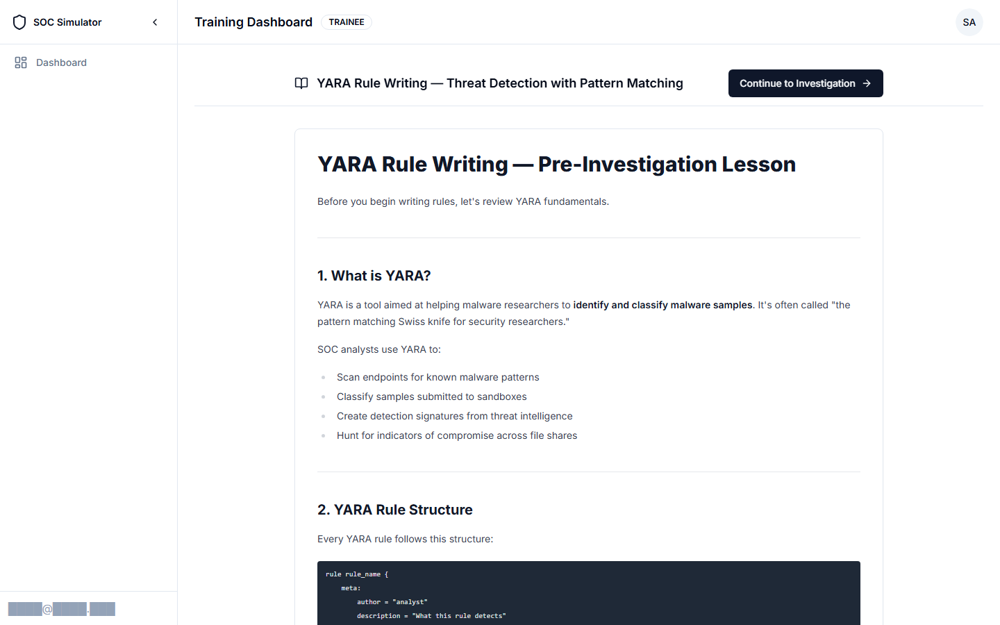
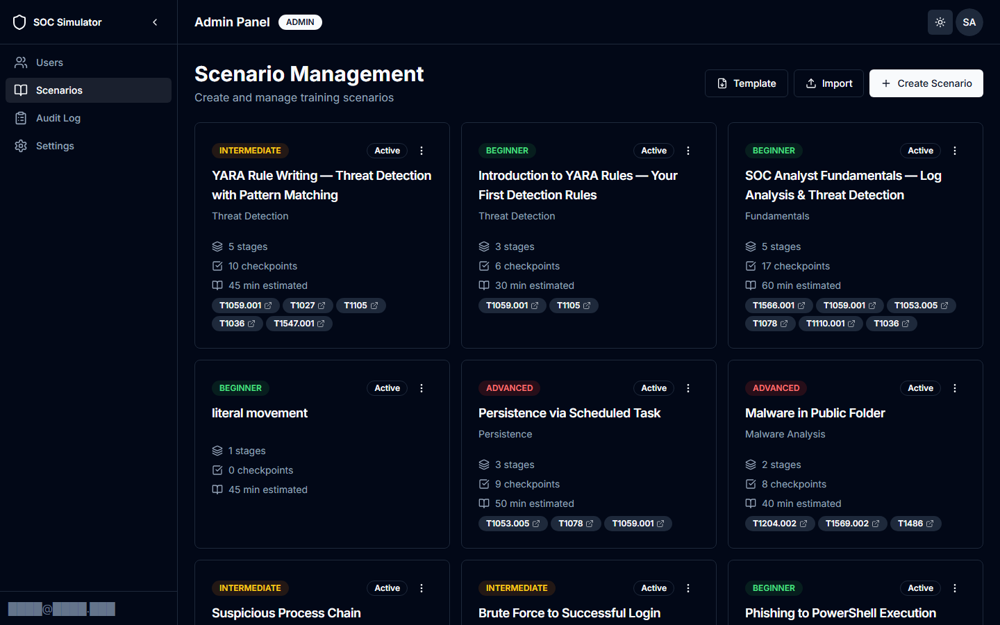
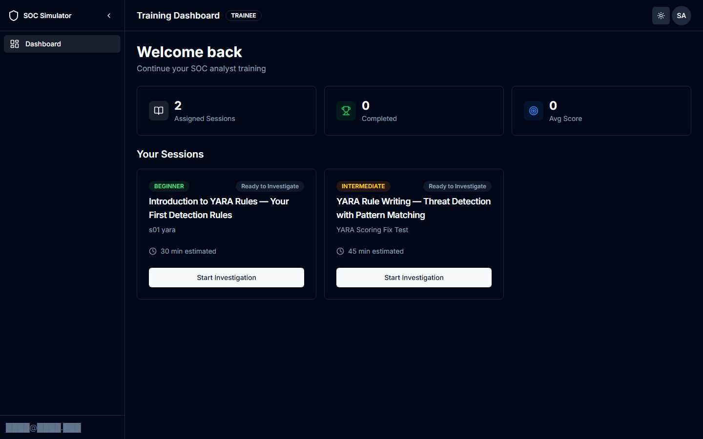

<p align="center">
  
</p>

<h1 align="center">SOC Training Simulator</h1>

<p align="center"><strong>An open-source platform that prepares SOC analysts for real incidents before they face one.</strong></p>

<p align="center">With a global shortage of 3.5 million cybersecurity professionals, most SOC training is either expensive, static, or disconnected from real investigation workflows. This platform closes that gap — free, self-hosted, and AI-powered.</p>

<p align="center">
  
</p>

[](https://github.com/abdullaalhussein/soc-training-simulator/stargazers)
[](https://github.com/abdullaalhussein/soc-training-simulator/actions/workflows/ci.yml)
[](https://nextjs.org/)
[](https://expressjs.com/)
[](https://www.postgresql.org/)
[](https://socket.io/)
[](https://www.prisma.io/)
[](https://www.typescriptlang.org/)
[](https://www.anthropic.com/)
[](https://vitest.dev/)
[](https://playwright.dev/)

---

## How It Compares

| Feature | SOC Training Simulator | LetsDefend | TryHackMe | CyberDefenders |
|---------|----------------------|------------|-----------|----------------|
| Open source | Yes (MIT) | No | No | No |
| Self-hosted | Yes | No | No | No |
| AI Mentor / Scoring | Yes (Claude) | No | No | No |
| AI Scenario Generator | Yes | No | No | No |
| Custom scenarios | JSON import + AI generator | Limited | Community rooms | Limited |
| Real-time trainer monitoring | Yes (Socket.io) | No | No | No |
| YARA rule playground | Yes | No | No | No |
| MITRE ATT&CK mapping | Yes (searchable picker) | Partial | No | Yes |
| Multi-role (Admin/Trainer/Trainee) | Yes | Single user | Single user | Single user |
| Security hardening | CSRF, lockout, audit log, CSP | N/A | N/A | N/A |
| Cost | Free (BYOK for AI) | $25/mo+ | $14/mo+ | Free tier limited |

---

## Screenshots

<table>
  <tr>
    <td width="50%">
      <strong>Trainer Console</strong><br>
      <em>Create sessions, assign scenarios, monitor trainees in real-time</em>
      <br><br>
      
    </td>
    <td width="50%">
      <strong>Investigation Workspace</strong><br>
      <em>3-panel layout: briefing, log viewer with filters, evidence collection</em>
      <br><br>
      
    </td>
  </tr>
  <tr>
    <td width="50%">
      <strong>Scenario Management</strong><br>
      <em>13 built-in scenarios with MITRE ATT&amp;CK mapping and difficulty levels</em>
      <br><br>
      
    </td>
    <td width="50%">
      <strong>Trainee Dashboard</strong><br>
      <em>Track assigned sessions, progress stats, and start investigations</em>
      <br><br>
      
    </td>
  </tr>
</table>

<details>
<summary><strong>More screenshots</strong> (landing page, dark mode, lesson view)</summary>

#### Landing Page
<p align="center">
  
</p>

#### Pre-Investigation Lesson
<p align="center">
  
</p>

#### Dark Mode
<p align="center">
  
</p>
<p align="center">
  
</p>

</details>

---

## Key Features

**Investigation & Training**
- **13 built-in scenarios** spanning Beginner to Advanced difficulty (phishing, brute force, lateral movement, DNS tunneling, APT campaigns, SQL injection, insider threat, YARA rules, SOC fundamentals)
- **Multi-stage scenario investigation** with configurable unlock conditions
- **10 realistic log types** — SIEM, EDR, Sysmon, Firewall, DNS, Network Flow, Proxy, Windows Event, Auth, Email Gateway
- **8 checkpoint types** — True/False, Multiple Choice, Severity Classification, Recommended Action, Short Answer, Evidence Selection, Incident Report, YARA Rule

**AI-Powered (Bring Your Own Key)**
- **AI SOC Mentor** — context-aware assistant that guides trainees with Socratic questioning (never gives away answers)
- **AI Scoring** — Claude grades Short Answer and Incident Report checkpoints with detailed feedback
- **AI Scenario Generator** — create new scenarios from a text prompt with difficulty-scaled token budgets
- **Graceful degradation** — platform is fully functional without an API key; AI features show "unavailable" state

**Trainer Tools**
- **Real-time monitoring** via Socket.io (hints, alerts, pause/resume, chat)
- **5-dimension scoring** — Accuracy (35%), Investigation (20%), Evidence (20%), Response (15%), Report (10%)
- **PDF & CSV reports** with detailed score breakdowns

**Security**
- httpOnly cookie auth, CSRF double-submit, DB-backed lockout, login anomaly detection
- Answer harvesting prevention, hint replay protection, AI prompt injection sanitizer
- Unicode normalization, audit logging, Content Security Policy, rate limiting

| Role | Capabilities |
|------|-------------|
| **Admin** | Manage users, scenarios, audit logs, system settings |
| **Trainer** | Create sessions, monitor trainees live, send hints, adjust scores |
| **Trainee** | Investigate scenarios, analyze logs, submit evidence & reports |

---

## Quick Start

> Setup takes approximately 5 minutes. Need help? Ask in [GitHub Discussions](https://github.com/abdullaalhussein/soc-training-simulator/discussions).

### Prerequisites

- **Node.js 20+**
- **Docker** (for PostgreSQL)
- **YARA 4.5+** (optional, for YARA checkpoint grading — included in Docker image)

### Local Setup

```bash
# 1. Clone & install
git clone https://github.com/abdullaalhussein/soc-training-simulator.git
cd soc-training-simulator
npm install

# 2. Configure environment
cp .env.example .env

# 3. Start database (PostgreSQL on port 5433, pgAdmin on port 5050)
docker-compose up -d

# 4. Push schema & seed demo data (includes all 13 scenarios)
npm run db:push
npm run db:seed

# 5. Start development servers
npm run dev
#   Client → http://localhost:3000
#   Server → http://localhost:3001
```

### Default Credentials

| Role | Email | Password |
|------|-------|----------|
| Admin | `admin@soc.local` | `Password123!` |
| Trainer | `trainer@soc.local` | `Password123!` |
| Trainee | `trainee@soc.local` | `Password123!` |

> [!WARNING]
> These are demo credentials for local development only. **Change all default passwords immediately** before deploying to any network-accessible environment. The server will log warnings on startup if default credentials are detected.

---

## AI Features (Bring Your Own Key)

| Feature | What it does | Works without API key? |
|---------|-------------|----------------------|
| **SOC Mentor** | Context-aware chat assistant that guides trainees using Socratic questioning | No (shows "unavailable" state) |
| **AI Scoring** | Grades Short Answer and Incident Report checkpoints with detailed feedback | No (falls back to keyword matching) |
| **AI Scenario Generator** | Creates new scenarios from a text description, scaled by difficulty level | No (button disabled with tooltip) |
| **AI Security Scan** | Scans AI-generated content for prompt injection risks | No (disabled) |

**To enable**, set `ANTHROPIC_API_KEY` in your `.env` file. See [Configuration Guide](docs/DEVELOPMENT.md#environment-variables) for all AI-related settings.

**Without an API key**, the platform is fully functional — all investigation, scoring, checkpoint, evidence, YARA, and reporting features work without AI.

---

## Tech Stack

| Layer | Technologies |
|-------|-------------|
| **Client** | Next.js 15, React 19, Tailwind CSS, Radix UI, Zustand, TanStack Query |
| **Server** | Express 5, Socket.io, JWT Auth, RBAC, CSRF, Prisma ORM, Zod, Helmet |
| **AI** | Anthropic Claude API (SOC Mentor, AI Scoring, Scenario Generator) |
| **Database** | PostgreSQL 16, Prisma ORM (18 models, 8 enums) |
| **Testing** | Vitest (96 unit + integration tests), Playwright (68 E2E tests across 22 spec files) |
| **DevOps** | Docker (multi-stage builds), Railway.app, GitHub Actions CI |

---

## Documentation

| Document | Description |
|----------|-------------|
| [Development Guide](docs/DEVELOPMENT.md) | Environment variables, scripts, project structure, testing |
| [Deployment Guide](docs/DEPLOYMENT.md) | Docker, Railway, CI/CD, production checklist |
| [API Reference](docs/API.md) | REST endpoints, Socket.io events, scoring system |
| [Architecture Presentation](docs/presentation.html) | 14 slides, bilingual EN/AR |
| [Security Policy](SECURITY.md) | Vulnerability reporting |
| [Threat Model](THREAT_MODEL.md) | STRIDE analysis — 31 threats, 6 residual risks |

---

## Enterprise & Custom Deployments

For organizations that need more than the open-source edition:

- **Managed cloud hosting** — fully provisioned instance, no setup required
- **SSO / SAML integration** — connect to your organization's identity provider
- **Custom scenario development** — tailored training content for your threat landscape
- **Dedicated support & SLA** — priority response for your team

**Contact:** [abdullaalhussein@gmail.com](mailto:abdullaalhussein@gmail.com)

---

## Community

Questions, ideas, or feedback? Join the conversation:

- [GitHub Discussions](https://github.com/abdullaalhussein/soc-training-simulator/discussions) — ask questions, share setups, suggest features
- [GitHub Issues](https://github.com/abdullaalhussein/soc-training-simulator/issues) — report bugs or request features

## Contributing

Contributions are welcome! Please read the [Contributor License Agreement](CLA.md) before submitting a pull request.

---

## License

This project is licensed under the [MIT License](LICENSE).

<p dir="rtl" align="right"><strong>محاكي تدريب مركز العمليات الأمنية</strong> — منصة تدريب متعددة الأدوار لمحللي الأمن السيبراني</p>

> If you find this project useful, please consider giving it a star — it helps others discover it and motivates continued development.
